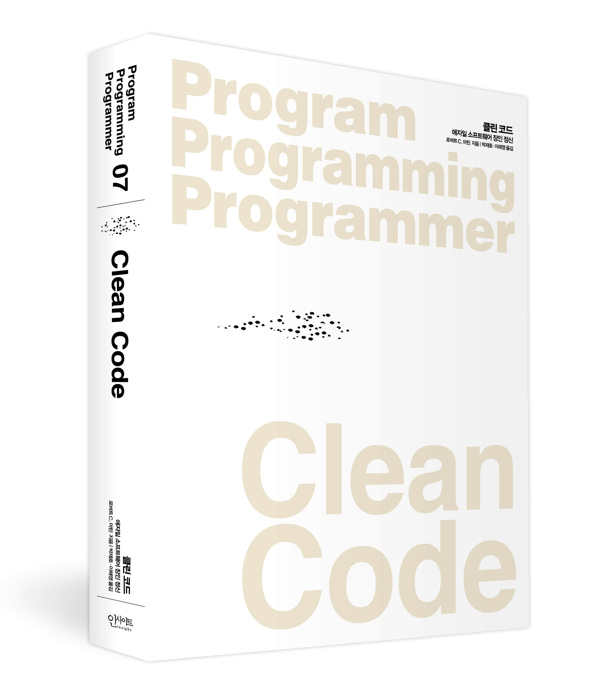

# 📖 Book Session - Clean Code
> Robert C.Martin 저자의 Clean Code를 읽고, 더 나은 코드를 고민하는 토의 세션을 진행하였습니다.

 

 

## 🙌 How to Study
- 매주 60p 정도의 Chapter를 읽습니다.
- 발제자는 그 주 분량에 대한 토론 주제를 발제합니다.
- 자유로운 형식으로 발제합니다. 다만, 코드 리뷰처럼 코드에 대한 의견을 공유할 수 있어야 합니다.
  

## 📆 Schedule
|Round| Date             |Scope| Done | Present             |
|-----|------------------|-----|---|---------------------|
|0| 24.03.07 20:00pm | | ✅ |                     |
|1| 24.03.10 20:00pm | Chap 1~3 | ✅ | 배장한                 |
|2| 24.03.18 20:00pm | Chap 4~6 | ✅ | 나현(4), 경서(5), 희철(6) |
|3| 24.03.24 21:00pm | Chap 7~9 | ✅ | 희철(7), 나현(8), 장한(9) |
|4| 24.04.01 20:00pm | Chap 10~12 | ✅ | 경서(10), 희철(11), 장한(12) |
|5| 24.04.08 20:00pm | Chap 13~14 | ✅ | 장한(13), 전체(14) |
|6| 24.04.15 20:00pm | Chap 15~16 | | 전체(15, 16) |

## 🚦Rules
### Commit Message
- `docs: {something}`: `README` 등 문서 수정
- `present: {title, chapterName, ...}`: 발표자료 업로드
- `comment: {title, chatperName, ...}`: 정리, 공유할 내용 등 스터디를 위한 기록물 

 

## 😀 스터디 참여자

<table>

<tr>
  <td align=center>
  <a href="https://github.com/aihoshistar">
  
   
  Back-end 🖥
   
  aihoshistar
  </a>
  </td>
 
  <td align=center>
  <a href="https://github.com/crispindeity">
  
   
  Back-end 🖥
   
  crispindeity
  </a>
  </td>
  
  <td align=center>
  <a href="https://github.com/newbieJanghan">
  
   
  Back-end 🖥
   
  newbieJanghan
  </a>
  </td>
  
  <td align=center>
  <a href="https://github.com/ghlnh">
  
   
  Back-end 🖥
   
  ghlnh
  </a>
  </td>
</tr>

  
</table>

 

