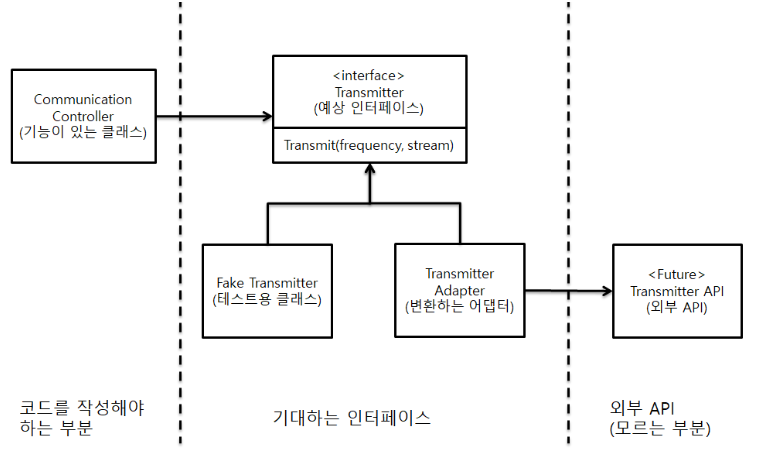

## 8장 경계

인터페이스 제공자와 인터페이스 사용자 사이에는 특유의 긴장이 존재한다. **패키지 제공자나 프레임워크 제공자는 적용성을 최대한 넓히려 애쓴다.** 더 많은 환경에서 돌아가야 더 많은 고객이 구매하니까. **반면, 사용자는 자신의 요구에 집중하는 인터페이스를 바란다.** 이런 긴장으로 인해 시스템 경계에서 문제가 생길 소지가 많다.

### 외부 코드 사용하기

ex) java.util.Map

```java
Map sensor = new HashMap();

Map<String, Sensor> sensors = SensorsFactory().get(); // 외부 라이브러리

Sensor s = sensors.get(sensorId);
```

💣문제점

1. Map이 제공하는 기본 메서드 자체 중 clea(), remove() 등을 값을 조작하거나 추가할 수 있는 문제 발생
2. Map은 객체 유형을 제한하지 않아 마음만 먹으면 어떤 객체 유형도 추가 가능
3. 사용자에게 필요하지 않은 기능까지 제공
4. 만약 인터페이스가 변한다면 소스 전반적으로 다 바꿔야 될 수도 있음
    
    👉실제로 자바 5에서 제네릭스 지원하면서 Map 인터페이스가 변했음
    

✅해결책 : Sensors 경계 클래스를 만들어 외부 코드 SensorsFactory().get()에서 리턴해주는 값을 조작할 수 있도록 수정

```java
public class Sensors {
    private Map<String, Sensor> sensors = SensorsFactory().get();
    
    public Sensor getById(String id) {
        return sensors.get(id);
    }
    
    // 이하 생략
}
```

👍위와 같이 바꿔서 얻는 장점

1. Sensors라는 경계 클래스를 만들어 호출하는 내부 코드에서 오용하기 어렵게 만들어준다.
2. SensorsFactory가 아닌 다른 SensorsFactory2를 사용한다고 하면 단순히 Sensors만 변경해주면 된다.
3. 외부 코드에서 가져온 값을 내부에서 사용하는 로직에 맞게 변환할 수 있는 장소가 생긴다.

➡️결론

경계 인터페이스를 여기저기 넘기지 말고 경계 인터페이스를 이용 할 때는 이를 이용하는 클래스나 클래스 계열 밖으로 노출되지 않도록 주의

**경계 클래스로 랩핑해서 불필요한 기능을 제한하고 내부 로직에 알맞게 사용**

### **경계 살피고 익히기**

**학습 테스트(Learning Test)를 작성**

*학습 테스트: (곧바로 우리쪽 코드를 작성해 외부 코드를 호출하는 대신) 먼저 간단한 테스트 케이스를 작성해 외부 코드를 익히는 것*

### 학습 테스트는 공짜 이상이다

학습테스트를 이용한 학습이 필요하든 그렇지 않든, 실제 코드와 동일한 방식으로 인터페이스를 사용하는 테스트 케이스가 필요하다. 이런 경계 테스트가 있다면 패키지의 새 버전으로 이전하기 쉬워진다. 그렇지 않다면 낡은 버전을 필요 이상으로 오랫동안 사용하려는 유혹에 빠지기 쉽다. 

### 아직 존재하지 않는 코드를 사용하기

지금 알지 못하는 코드 (ex. 다른 팀에서 아직 구현 안됨)를 구현할 때 자체적으로 인터페이스를 정의



*ADAPTER 패턴 : 한 클래스의 인터페이스를 클라이언트에서 사용하고자 하는 다른 인터페이스로 변환한다. 어댑터를 이용하면 인터페이스 호환성 문제 때문에 같이 쓸 수 없는 클래스들을 연결해서 쓸 수 있다.*

- API 사용을 캡슐화해 API가 바뀔 때 수정할 코드를 한곳으로 모으면 구현을 나중으로 미룰 수 있음
- 테스트도 아주 편하다. API 인터페이스가 나온 다음 테스트 케이스를 생성해 API를 올바로 사용하는지 테스트 가능

### 결론

- 경계에 위치하는 코드는 깔끔히 분리
- 기대치를 정의하는 테스트 케이스도 작성
- 통제가 불가능한 외부 패키지에 의존하는 대신 통제가 가능한 우리 코드에 의존
- 외부 패키지를 호출하는 코드를 가능한 줄여 경계를 관리
    - 새로운 클래스로 경계 감싸기 (ex: Map 인터페이스)
    - ADAPTOR패턴을 사용해 원하는 인터페이스를 패키지가 제공하는 인터페이스로 변환