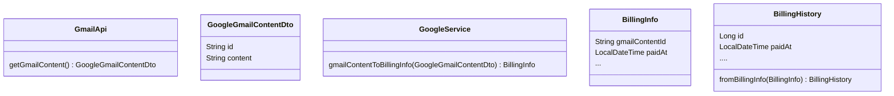

## 코더도 항상 존재할까?

**경서** \
코드가 우리의 요구사항 명세인지 판단하는 것은 엔지니어의 몫이다.\ 
코드는 gpt가 만들고 판단은 개발자가 하면, 개발자는 코더인가? 코드 리뷰어이지 않나. \
전문성 측면에서 chat gpt를 안쓰는 사람이 더 높지만 \
퍼포먼스 측면에서는 chat gpt를 적극적으로 쓰는 사람이 더 높을 것. 퍼포먼스 측면에서는 잘 활용하되 너무 의존하지 말아라. 

**희철** \
IDE 안 쓰고 노트패드에 코딩할 줄 알아야한다는 교수님도 계셨음. \ 
gpt를 신뢰할 수 없지만 구글 검색이 나왔을 때와 같이 시대적 흐름. 결국 진위 여부는 구글 검색도, gpt도 마찬가지. \
생성형 인공지능은 생산성을 위해서라도 사용할 줄 알아야 한다. \
이제 프로그래머는 코드 작성을 gpt에게 일임하고 진위 여부를 판단하고 설계하는 일을 해야할 것. \
근데 요즘 진위 여부 판단도 gpt가 해결해줄 것 같긴 함. \
개발자는 결국 gpt가 판단할 수 없는 도메인 관련 설계에 더 주목하게 될 것. \
결론, 시대의 흐름에 적응해야한다.

**나현** \
인공지능이 제시하는 정보에서 진위 여부를 판별할 줄 아는 능력이 개발자에게 중요해질 것이다.

**장한** \
클린 코드력을 키우는 건 코더로서 역량을 키워야하는 것이지 않을까?

**희철** \
클린 코드는 정답이 정해져있지 않음. 연차가 쌓였다 해서 클린코드를 잘 쓰진 않는 것 같음. 오히려 연차가 쌓이면 자기만의 생각에 갇힐 확률이 더 크다고 생각.

**나현** \
깨끗한 코드는 예술. 뭐가 더 클린하냐는 각자의 주관.

**장한** \
개발자가 ide에 직접 코드를 작성할 일이 앞으로 있을까요?

**희철** \
좋은 코드를 판단하는 기준이 팀바팀, 회사바이회사.
이런 기준점을 gpt에 설정할 수 있다면 진짜 코더 일이 없어질 것.

---
## 이름에 의도를 명확히 하라
**경서** \
이름이 길어도 축약하면 의도를 알 수가 없음.
만약 줄인다면 팀 내 규칙을 정할듯.

**희철** \
축약을 굉장히 싫어함. 그나마 빼자면 Request가 결국 data transfer니까 Dto를 뺏을 것. \
최근에 회사에서 축약 컨벤션을 문서화했음. \
근데 이게 또 코드를 이해하기 위해 문서를 봐야하고 문서도 관리해야하니 불편함. \
회사는 왜 축약을 좋아하는가. 높으신 분이 길게 쓰는 걸 이해하지 못함. \
개인적으로 아무 것도 모르는 사람이 내 코드를 봐도 이해할 수 있어야 한다고 생각. 이해를 위해서라면 축약, 그리고 축약을 이해하기 위해 문서를 보는 것은 너무 생산성이 떨어짐. \
축약하는 이유가 ,, 길게 타이핑하기 싫어서.

**나현** \
첫 회사, 축약이 심함. 바로 이해가 된다는 점에서 축악을 비선호.

**경서** \
축약을 이상하게 하는 동료가 있었음.
returnValue = 'rv' ㅋㅋㅋㅋ

---
## 객체 설계와 네이밍

**희철** \
하나의 도메인으로 뺄 것. 어차피 구글 말고도 다른 api도 호출할 것이었으니까요. \
gmailContentId를 그냥 id. Billing'Info'에서 Info를 뺄듯. \
BillingInfo가 없어도 된다고 생각. 결합도를 낮출 목적이라면 도메인화할 것.

**경서, 나현** \
BillingInfo를 BillingInfoBy${Data}


---
## gmailToBillingHistory
```javascript
function gmailToBillingHistory(gmail: GmailParsedItem) {
  const billingHistory = BillingHistory.create();

  billingHistory.organizationId = 0;
  billingHistory.invoiceAppId = 0;
  //...

  if (gmail.billingInfo) {
    const { billingInfo } = gmail;

    billingHistory.paidAt = billingInfo.paidAt;
    if (billingInfo.payAmount) {
      billingHistory.payAmount = Money.create({
        ...billingInfo.payAmount,
      });
    }
  } else {
    // billingInfo 가 없다는 뜻은,
    // ...중략
    const issuedAt = gmail?.metadata?.date;
    billingHistory.paidAt = null;
  }

  return billingHistory;
}
```
**경서** \
확실한 문제는 이 함수가 너무 많은 역할을 수행하고 있음.\
많이 고민하는 경험인데, 특정 함수의 관심사를 분리해도 어차피 여기서만 쓰이는데 굳이? 싶었음. \

함수 내부에서 조건문이 들어가니까 이걸 함수 밖에서 조건을 판단하여 실행하도록 함수 분리.
- 일단 billingInfo가 있고 없고를 밖에서 정하기.
- payAmount를 만들지 만들지를 밖에서 정하기.

---
## chapter 3의 기억나는 부분
**장한** \
매개변수의 갯수을 줄여보자. 갯수가 늘어나면 메서드의 네이밍 역시 길어진다. 
