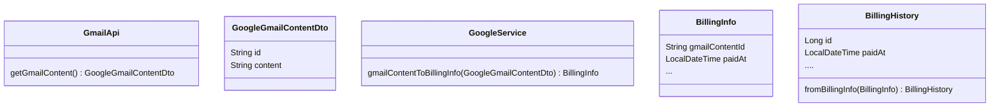

# 1회차 Chapter 1~3 배장한

## Chapter 1
### 코드는 항상 존재하리라. 코더도 항상 존재할까?
*p.2* \
코드는 상세하고 정밀한 요구사항 명세라는 점에 깊이 공감합니다.
요구사항을 표현하는 수단으로서 코드는 필연적으로 사라질 수 없다고 합니다.
하지만 코더(프로그래머)는 어떨까요? 생성형 인공지능이 "정밀한 요구사항"으로서 코드를 잘 작성하는 시대가 온다면 코더의 존재 가치가 있을까요?


## Chapter 2
### 이름에 의도를 명확히 하라
*p.22* \
함수 네미잉에서 의도에 기반한 서술은 항상 길이가 길어지곤 하는데요. 다들 어떻게 생각하시나요? 
```javascript
class CreateAccountPermissionRequestDto {}
// CreateAccPerReqDto ? lol
```

### 불용어: 특정한 의미를 가지지 않는 단어 
*p.32* \

이 객체 관계에서 BillingInfo를 대체할 수 있는 네이밍은? \
또는 다시 설계한다면 어떻게?


### 생성자 네이밍 센스
생성자를 오버로딩하는 경우, 생성자가 필요한 파라미터를 정적 메서드를 활용하여 명확히 드러내는 것이 좋습니다.
한편, 생성자 오버로딩으로 생략된 프로퍼티 멤버의 초기화는 어떻게 책임져야할까요? 책임질 필요가 없는 걸까요? \
해당 프로퍼티가 존재하는지를 밖에서 알 수가 없다는게 찝찝합니다.
```java
public class Money {
    public Money(int amount) {
        this.amount = amount;
    }

    public Money(int amount, Currency currency) {
        this.amount = amount;
        this.currency = currency;
    }

    // 어떤 프로퍼티가 채워지는지를 class 밖에서 알 수 없다.
    Money money = new Money(10000);
    // 이렇게 하면 생성자의 목적을 알 수 있다.
    Money money = Money.FromAmount(10000); 
}
```

---
## Chapter 3
### 함수 로직은 일관된 추상화 정도를 가진다.
아래 자바스크립트 함수를 평가해봅시다.
```javascript
function gmailToBillingHistory(gmail: GmailParsedItem) {
  const billingHistory = BillingHistory.create();

  billingHistory.organizationId = 0;
  billingHistory.invoiceAppId = 0;
  //...

  if (gmail.billingInfo) {
    const { billingInfo } = gmail;

    billingHistory.paidAt = billingInfo.paidAt;
    if (billingInfo.payAmount) {
      billingHistory.payAmount = Money.create({
        ...billingInfo.payAmount,
      });
    }
  } else {
    // billingInfo 가 없다는 뜻은,
    // ...중략
    const issuedAt = gmail?.metadata?.date;
    billingHistory.paidAt = null;
  }

  return billingHistory;
}
```